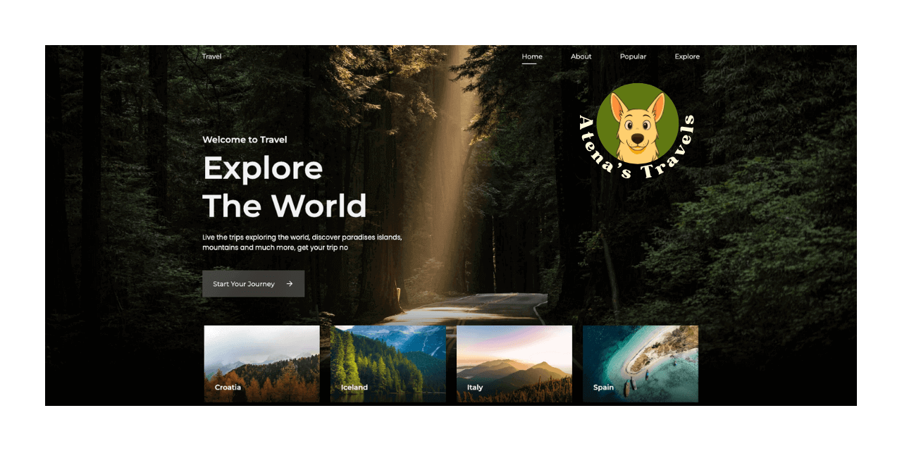

# Travel Landing Page 🌍

A modern and responsive landing page for travel services, built with HTML, CSS, and vanilla JavaScript.

## 📋 Description

This project features an elegant and engaging landing page for a travel agency or tourism service. The page is designed to capture visitors' attention and convert them into potential customers through attractive design and interactive functionality.

## 🚀 Features

- **Responsive Design**: Optimized for desktop, tablet, and mobile devices
- **Smooth Animations**: Implemented with JavaScript for better user experience
- **Scroll Reveal**: Element appearance effects during scroll
- **Performance Optimized**: Fast loading and optimized code
- **Cross-browser Compatibility**: Compatible with all modern browsers

## 🛠️ Technologies Used

- **HTML5**: Semantic and accessible structure
- **CSS3**: Modern styling with flexbox/grid and animations
- **JavaScript (Vanilla)**: Interactivity and animations
- **ScrollReveal.js**: Library for scroll animations

## 📁 Project Structure

```
travel-landing-page/
├── index.html              # Main page
├── style.css              # Main stylesheet
├── main.js                # Main JavaScript file
├── scrollreveal.min.js    # Scroll animations library
├── assets/
│   └── img/               # Images and graphic resources
└── README.md              # Project documentation
```

## 🌐 Live Demo

🔗 **[View Live Site](https://atenastravels.netlify.app/)**



### Quick Start

1. **Clone the repository**
   ```bash
   git clone https://github.com/[your-username]/travel-landing-page.git
   cd travel-landing-page
   ```

2. **Open the project**
   ```bash
   # Method 1: Open index.html directly in browser
   open index.html
   
   # Method 2: Use a local server (recommended)
   # With Python 3
   python -m http.server 8000
   
   # With Node.js (if you have live-server installed)
   live-server
   
   # With VS Code Live Server extension
   # Right-click on index.html → "Open with Live Server"
   ```

3. **View in browser**
   - Open `http://localhost:8000` if using a local server
   - Or open the `index.html` file directly

## 📄 License

This project is released under the MIT License. See the [LICENSE](LICENSE) file for more details.

## 🤝 Contributing

Contributions are welcome! To contribute:

1. Fork the project
2. Create a feature branch (`git checkout -b feature/your-feature-name`)
3. Commit your changes (`git commit -m 'Add your feature description'`)
4. Push to the branch (`git push origin feature/your-feature-name`)
5. Open a Pull Request
